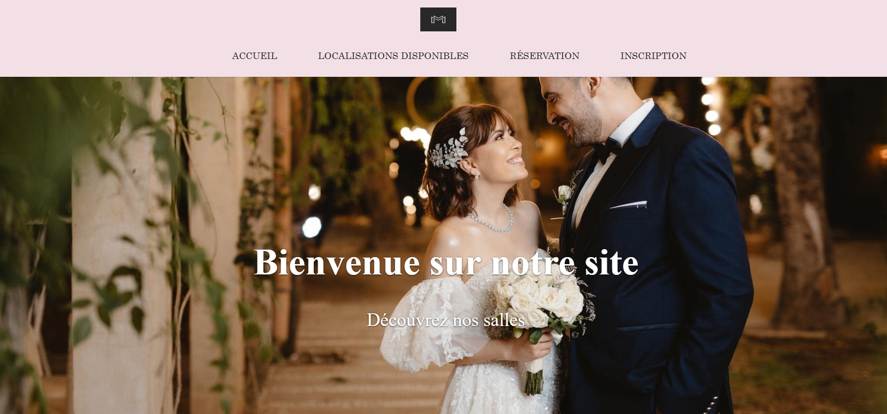
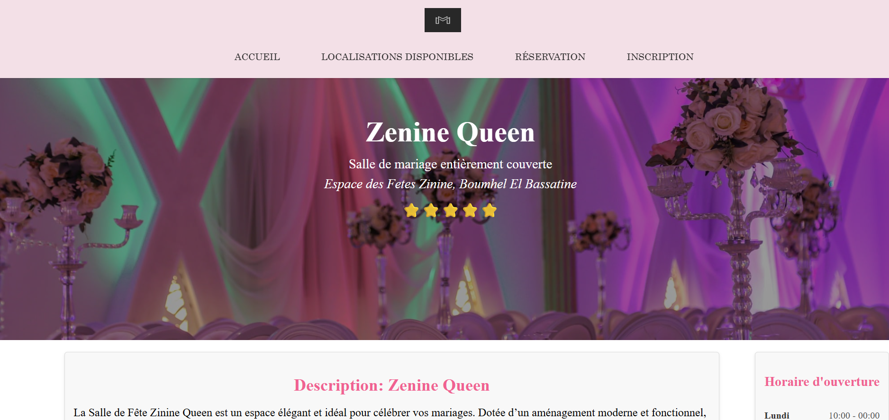
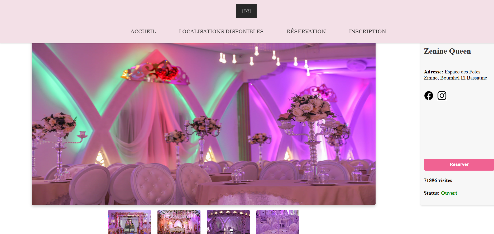
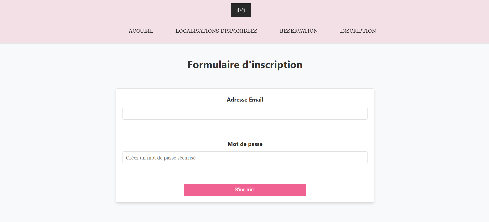

## Event Halls Management Project

## Description
This academic project is an application for managing event halls.  
It allows users to manage reservations, clients, and hall availability easily and efficiently.

## Features
- View existing halls (description, photos, schedule)  
- User authentication (clients)  
- Reservation management

## Technologies Used
- **Frontend:** HTML, CSS, JavaScript  
- **Backend:** Native PHP  
- **Database:** MySQL

## Preview
Here are some screenshots of the application:

