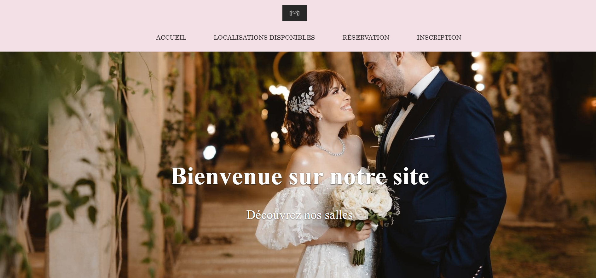
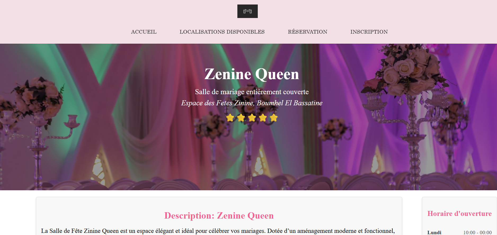
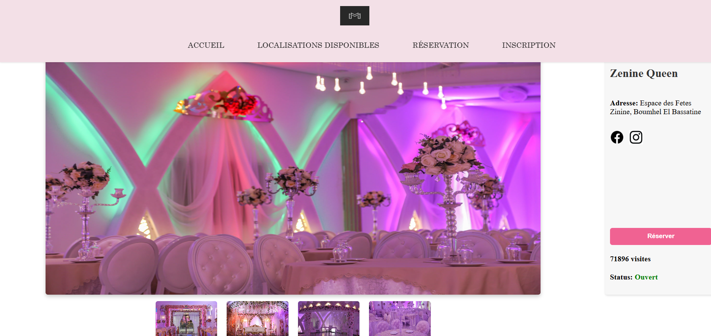
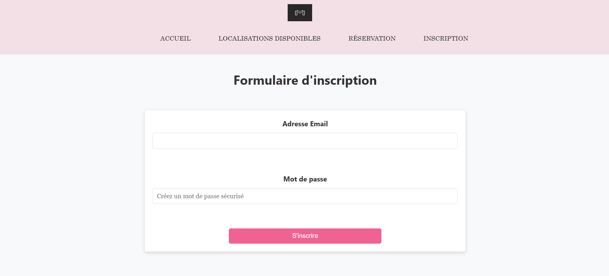

# Projet Salles des Fêtes 🎉

## 📌 Description
Ce projet (projet académique) est une application de gestion des salles des fêtes.  
Elle permet de gérer les réservations, les clients et la disponibilité des salles de manière simple et efficace.

## 🚀 Fonctionnalités
- Consultation des salles existantes (description, horaires, photos)  
- Authentification des utilisateurs (clients)  
- Gestion des réservations  

## 🛠️ Technologies utilisées
- **Frontend :** HTML, CSS, JavaScript  
- **Backend :** PHP natif  
- **Base de données :** MySQL  

## 🖼️ Aperçu

### Page d'accueil

### Présentation salle (partie 1)

### Présentation salle (partie 2)

### Page d'inscription
